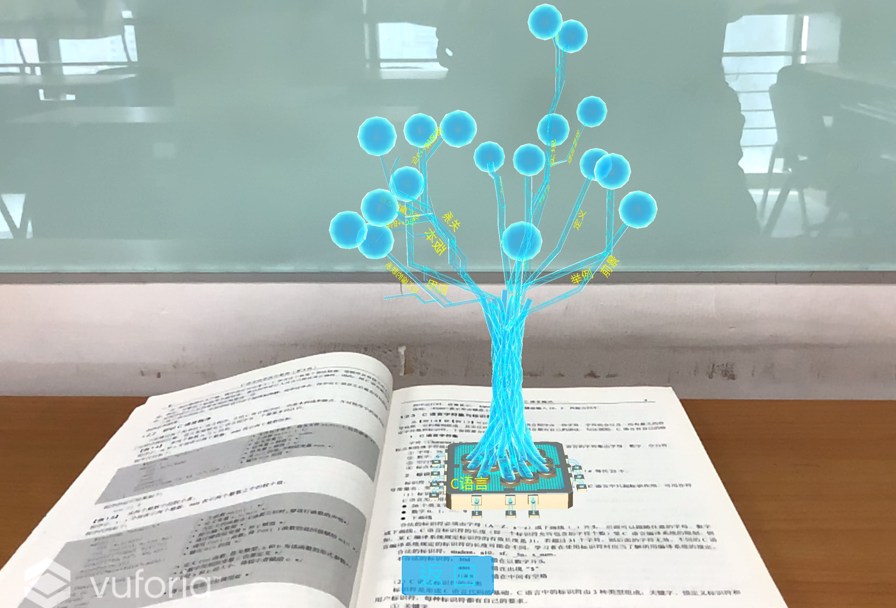

# Knowledge Forest AR

## Welcome to Knowledge Forest AR APP

## Introduction
**ARKnowledgeForest** is an Augmented Reality Application. Compared with traditional applications, we use a more interesting, vivid way to display knowledge and make learning more fun. Using Augmented Reality(AR), we visualize the Knowledge Forest with 3D form. 

No matter which course or which book, what you need to do is to open the APP, scanning any page of the book, then you can see all the key words are framed. Touching the key word you are interested in or willing to learn more about, ARKnowledgeForest will automatically build the AR-Tree-Model of the key word. And then, touch the little ball(knowledge fragments set), you can learn any knowledge fragment you want.

## What we have achieved
* Scan pages, identifying the content and detect keywords.
* Tracking the keywords.
* Automatically building 3D Tree Model based on the data form the keywords' knowledge map.
* Visualize the Knowledge Map Data by AR.

## What we are going to finish
* Construct relationships among keywords.
* Automatically construct a Sand Table of the knowledge map.
* Provide the relationship between various courses and a reference learning route.
* Provide an open API that allows users to access their own data to build AR models.

## Key steps to achieve these functions
The application is based on [Unity3D](https://unity.com/).
1. Using the Unity3D Engine to get a frame from the camera when you touch the Begin Button.
2. Encode the frame and send it to an OCR API supported by [BAIDU-AI](http://ai.baidu.com/) to get all of the words in the frame with their coordinates.
3. Collect all the keywords from them to prepare for the next step. 
4. Initialize a MOSSE Tracker supported by [OpenCV for Unity](https://enoxsoftware.com/opencvforunity/) to track the keywords. Since that the keywords are usually so small and ordinary that are not very easy to be tracked, we propose a new way to solve the problem. Here, we just track the whole text area which has distinct features in the frame, and calculate the offset of each keyword relative to the text area.
5. Get the keyword's data from the Knowledge Forest Database. Using these datas to build a 3D Tree Model.
6. Place the Tree Model on a ground plane of the physical world using AR supported by [Vuforia](https://www.ptc.com/en/products/augmented-reality).

## Download and Use
* To get more information, welcome to our official website.
<https://www.littlegenius.xin/ARTree/>
* Now you can download an IOS APP from next website:
<https://fir.im/t6b9?utm_source=fir> 
or using an IOS device to scan the following QR code. 

